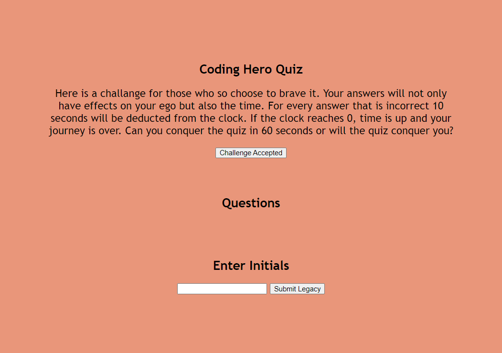

# code-quiz

## Table of Contents 
- [Description](#description)
- [Visuals](#visuals)
- [Resources](#resources)

## Description

This is a quiz with a timer that is supposed to take your time and make it your score at the end. 

If the answer is incorrect 10 seconds will be deduced from the timer. There are 5 questions, each with 4 answers. Currently it is not perfect but I assure you, a lot of work went into what is here.

- [Click to navigate back to the Table of Contents](#table-of-contents)

## Visuals

- [Click to navigate back to the Table of Contents](#table-of-contents)

## Resources
- [Live Site](https://grilledcheeseplease.github.io/code-quiz/)
- [Repository](https://github.com/grilledcheeseplease/code-quiz)

- [Click to navigate back to the Table of Contents](#table-of-contents)